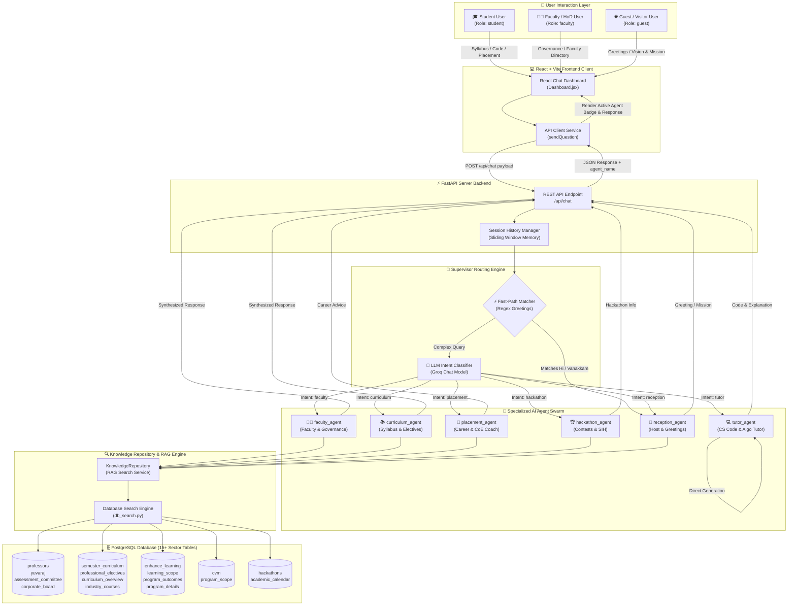
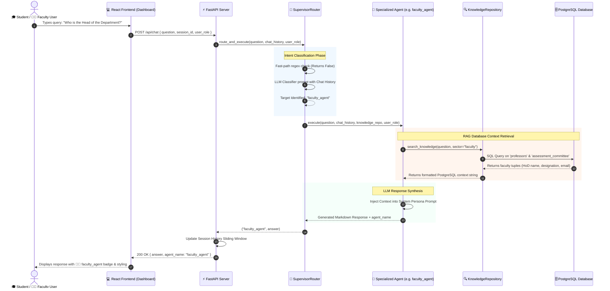
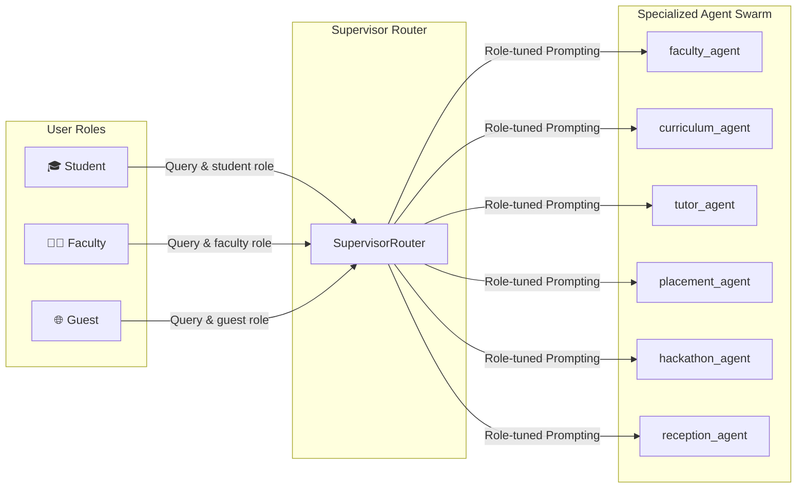

# 📐 CSE-Bot Multi-Agent System Architecture & Data Flow

This document provides visual diagrams and detailed explanations of the **CSE-Bot Multi-Agent Architecture**, illustrating how different users interact with specialized AI agents, how the **Supervisor Router** coordinates agent execution, and how agents query the underlying **PostgreSQL Knowledge Database**.

---

## 📦 High-Level System Block Diagram

```text
+---------------------------------------------------------------------------------------------------+
|                                      USER INTERACTION LAYER                                       |
|  +---------------------------+  +---------------------------+  +-------------------------------+  |
|  |     🎓 Student User       |  |   👨‍🏫 Faculty / HoD User  |  |    🌐 Guest / Visitor User    |  |
|  |  (Syllabus/Code/Careers)  |  |   (Governance/Directory)  |  |     (Greetings/Mission)       |  |
|  +-------------+-------------+  +-------------+-------------+  +---------------+---------------+  |
+----------------|------------------------------|--------------------------------|------------------+
                 |                              |                                |
                 +------------------------------+--------------------------------+
                                                |
                                                v
+---------------------------------------------------------------------------------------------------+
|                                      FRONTEND CLIENT LAYER                                        |
|  +---------------------------------------------------------------------------------------------+  |
|  |                                  React 19 + Vite Web App                                    |  |
|  |             [Chat Dashboard]  --->  [Session Manager]  --->  [ApiClient Service]            |  |
|  +--------------------------------------------+------------------------------------------------+  |
+-----------------------------------------------|---------------------------------------------------+
                                                | HTTP POST /api/chat payload
                                                v
+---------------------------------------------------------------------------------------------------+
|                                       FASTAPI BACKEND GATEWAY                                     |
|  +---------------------------------------------------------------------------------------------+  |
|  |                        Session Memory & Request Handler (main.py)                           |  |
|  +--------------------------------------------+------------------------------------------------+  |
+-----------------------------------------------|---------------------------------------------------+
                                                |
                                                v
+---------------------------------------------------------------------------------------------------+
|                                      SUPERVISOR ROUTER ENGINE                                     |
|  +---------------------------------------------------------------------------------------------+  |
|  |              Regex Fast-Path Matcher  <--->  Groq LLM Intent Classifier (Llama 3.3)         |  |
|  +--------------------------------------------+------------------------------------------------+  |
+-----------------------------------------------|---------------------------------------------------+
                                                | Delegates Execution
                                                v
+---------------------------------------------------------------------------------------------------+
|                                  SPECIALIZED AGENT SWARM (agents.py)                              |
|  +---------------+  +------------------+  +---------------+  +-----------------+  +------------+  |
|  | faculty_agent |  | curriculum_agent |  |  tutor_agent  |  | placement_agent |  | ... agents |  |
|  +-------+-------+  +--------+---------+  +-------+-------+  +--------+--------+  +-----+------+  |
+----------|-------------------|--------------------|-------------------|-----------------|---------+
           |                   |                    |                   |                 |
           +-------------------+---------+----------+-------------------+-----------------+
                                         | RAG Search Request
                                         v
+---------------------------------------------------------------------------------------------------+
|                                     KNOWLEDGE REPOSITORY RAG                                      |
|  +---------------------------------------------------------------------------------------------+  |
|  |                              KnowledgeRepository (db_search.py)                             |  |
|  +--------------------------------------------+------------------------------------------------+  |
+-----------------------------------------------|---------------------------------------------------+
                                                | SQL Query Execution
                                                v
+---------------------------------------------------------------------------------------------------+
|                                     POSTGRESQL DATABASE LAYER                                     |
|  +--------------------+  +-----------------------+  +-------------------+  +-------------------+  |
|  | professors, yuvaraj|  | semester_curriculum,  |  | enhance_learning, |  | cvm, hackathons,  |  |
|  | assessment_comm... |  | professional_elect... |  | program_outcomes  |  | academic_calendar |  |
|  +--------------------+  +-----------------------+  +-------------------+  +-------------------+  |
+---------------------------------------------------------------------------------------------------+
```

---

## 👥 1. End-to-End Multi-Agent System Flowchart

The following diagram illustrates how **Student**, **Faculty**, and **Guest** users connect through the React UI to the FastAPI Supervisor Router, which classifies intent, delegates queries to specialized agents, and fetches context from PostgreSQL tables.



---

## 🔄 2. Sequence Diagram: Inter-Agent Routing & Interaction

The following sequence diagram shows the step-by-step interaction between a user, the **Supervisor Router**, the targeted **Specialized Agent**, the **RAG Knowledge Repository**, and **PostgreSQL**.



---

## 🏛️ 3. Agent-to-Database Mapping Table

| Specialized Agent | Role & Domain Boundary | Target PostgreSQL Tables | Sample Queries Handled |
| :--- | :--- | :--- | :--- |
| 👨‍🏫 **`faculty_agent`** | Faculty directory, HoD, designations, research domains, committees | `professors`, `yuvaraj`, `assessment_committee`, `corporate_board` | *"Who is the HoD?"*, *"Dr. Subha's email address?"* |
| 📚 **`curriculum_agent`** | Semester syllabus, electives, credit distribution, industry courses | `semester_curriculum`, `professional_electives`, `curriculum_overview`, `industry_courses` | *"Cloud computing syllabus details"*, *"Electives in Sem 6"* |
| 💻 **`tutor_agent`** | CS programming mentor, code generation, algorithm analysis | *Generates code directly / CS algorithm knowledge* | *"Write quicksort in C++"*, *"Explain recursion in Python"* |
| 🚀 **`placement_agent`** | Placement search engine, stats discovery, copy-ready template composer | `enhance_learning`, `learning_scope`, `program_outcomes`, `program_details` | *"CoE labs in CSE?"*, *"Placement statistics & tips"* |
| 🏆 **`hackathon_agent`** | Hackathon search engine, SIH/Google Challenge info, copy-ready announcement builder | `hackathons`, `academic_calendar` | *"Upcoming hackathons"*, *"SIH registration details"* |
| 💬 **`reception_agent`** | Host, greetings, farewells, department vision & mission | `cvm`, `program_scope` | *"Vanakkam"*, *"Tell me CSE vision and mission"* |

---

## 🔀 4. Multi-User Access & Role Context Matrix


