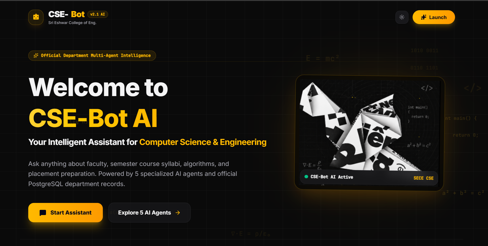

# Chitti AI — Intelligent Multi-Agent Virtual Robot

## Overview & Description

**Chitti AI** (inspired by Superstar Rajinikanth's iconic Enthiran robot — *"Speed 1 Terahertz, Memory 1 Zettabyte!"*) is an intelligent, multi-agent virtual robot assistant designed for the **Department of Computer Science & Engineering (CSE)** at **Sri Eshwar College of Engineering (SECE)**. Powered by React 19, Vite, Tailwind CSS v4, FastAPI, LangChain, Groq (Llama-3.3-70b-versatile), and PostgreSQL, Chitti AI delivers real-time, high-speed, context-grounded assistance across department governance, academic planning, programming mentorship, and career development.

The system utilizes a **Supervisor Router** that inspects incoming user queries and dynamically delegates them to one of **5 specialized domain AI agents**:

1. **Faculty Directory Specialist (`faculty_agent`)**: Provides instant information on professors, Head of Department (HoD), designations, research domains, email contacts, and committee leadership (UG PAC, Corporate Board).
2. **Curriculum & Syllabus Specialist (`curriculum_agent`)**: Guides students through semester course distributions, course syllabi, professional electives, industry-offered courses, and credit requirements.
3. **CS Programming & Algorithm Tutor (`tutor_agent`)**: Mentors students in programming syntax (Python, C++, Java, SQL), data structures, algorithm complexities ($O(n \log n)$), and code debugging.
4. **Career & Placement Coach (`placement_agent`)**: Details Centers of Excellence (CoEs), hackathons, skill development labs, student achievements, placement highlights, and Program Outcomes (POs).
5. **Multi-Lingual Virtual Robot Host (`reception_agent`)**: Handles casual greetings (English, Tamil, Tanglish, Hindi), farewells, department vision and mission explanations, and iconic Chitti Robot pleasantries.

---

## Comprehensive Documentation

Detailed technical documentation suites for developers, maintainers, and system administrators are available in the repository:

- **[Multi-Agent System Architecture & Flowchart](file:///d:/CSE-bot/ARCHITECTURE_DIAGRAM.md)**: Visual Mermaid diagrams showing multi-user role flows, Supervisor Router intent classification, specialized agent swarm execution, RAG pipeline, and PostgreSQL sector table maps.
- **[Client Documentation Suite](file:///d:/CSE-bot/client_documentation/README.md)**: Architectural breakdown, OOP design patterns, component functions, Material 3 design system, mobile responsive layout fixes, and developer setup guide.
- **[Server Documentation Suite](file:///d:/CSE-bot/server_documentation/README.md)**: FastAPI backend architecture, Supervisor intent classification, polymorphic agent hierarchy, PostgreSQL knowledge repository, and deployment blueprints (credentials sanitized).