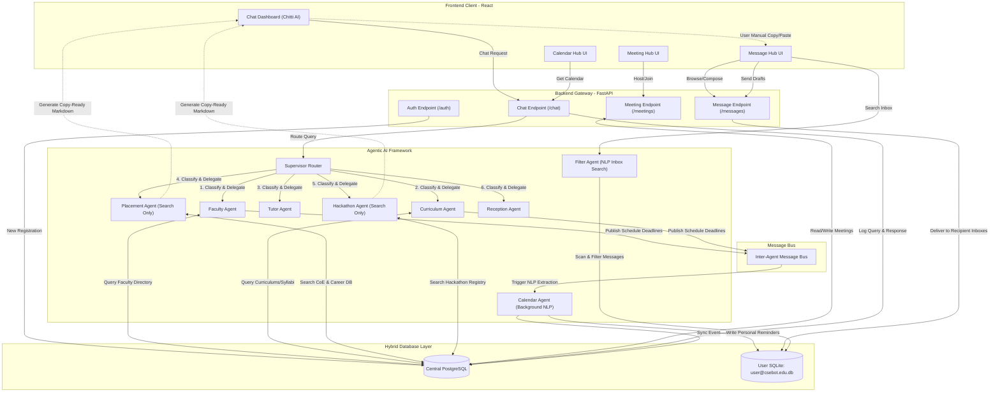

# CSE-Bot Services, Agent Workflow & Communication Wireframe

This document outlines how every service, user registration, and detail is stored across our hybrid database system, and includes a detailed Mermaid workflow wireframe of the agent-to-agent communication architecture.

---

## 💾 1. Data Storage Architecture

Every single transaction, user account, and message is persisted securely in one of two database layers depending on its scope:

### A. Central Shared Database (PostgreSQL)
Used for shared, system-wide data, registries, and collaborative spaces:
* **User Accounts**:
  - **Students**: Registered under the `d_section_students` table (name, email, password, section, year).
  - **Faculty**: Registered under the `faculty_accounts` table (name, email, password, designation, role).
* **RAG Knowledge Base**:
  - Course syllabi, electives, credit distributions, faculty rosters, CoE details, placement statistics, and FAQs.
* **Meeting Hub**:
  - Centralized Google Meet metadata (`meetings`), participants (`meeting_participants`), group chats (`meeting_chats`), and real-time meeting events.
* **Academic Calendar**:
  - Roster of central academic deadlines and CAT exams (`academic_events`).
* **Agent Telemetry & Audit Logs**:
  - History of agent classifications, query trajectories, and responses (`agent_activity_logs`).

### B. Isolated User Databases (Dynamic SQLite)
Used to enforce data privacy, individual inbox storage, and study planners. Every user has a separate SQLite database file dynamically loaded at `server/databases/{user_email}.db` containing:
* **Personal Message Hub**:
  - Incoming inbox and outgoing draft/sent messages (`messages` table).
* **Personal Calendar**:
  - Individual study task schedules and personal planners (`personal_events` table).

---

## 📊 2. Services & Agent Workflow Diagram

Below is the workflow showing how queries flow from the UI, through the supervisor and specialized agents, and sync across the database layers.

---

## 🔄 3. Step-by-Step Data Flows

### A. New User Registration Workflow
1. The user inputs their credentials in the signup UI.
2. The UI sends a request to `/auth/student/register` (or `/auth/faculty/register`).
3. The auth handler hashes the password and saves the profile in the central PostgreSQL database.
4. **On first login**: A personal SQLite file `server/databases/{user_email}.db` is initialized to hold the user's isolated inbox and planner tables.

### B. Placement & Hackathon Info Search (Pure Search Engine Workflow)
1. The user asks the Chat Dashboard for a placement update.
2. The **Supervisor Router** detects the intent and forwards the question to the **Placement Agent**.
3. The Placement Agent queries the PostgreSQL RAG databases (`program_details`, `learning_scope`).
4. The agent formats the findings into a **copy-ready Markdown template** and returns it to the user.
5. The user reviews the layout in the UI, copies it, and navigates to the **Message Hub** to manually send it to student groups.

### C. Automatic Meeting Schedule & Calendar Sync Workflow
1. The user schedules a meeting for Section D via the **Meeting Hub**.
2. The Meeting Agent writes the central meeting and list of participants to PostgreSQL.
3. The Meeting Agent publishes a schedule notification to the **Inter-Agent Message Bus**.
4. The background **Calendar Agent** receives the notification, extracts the date/topic via NLP, and saves the reminder into the private SQLite databases (`databases/{student_email}.db`) of all Section D students.
